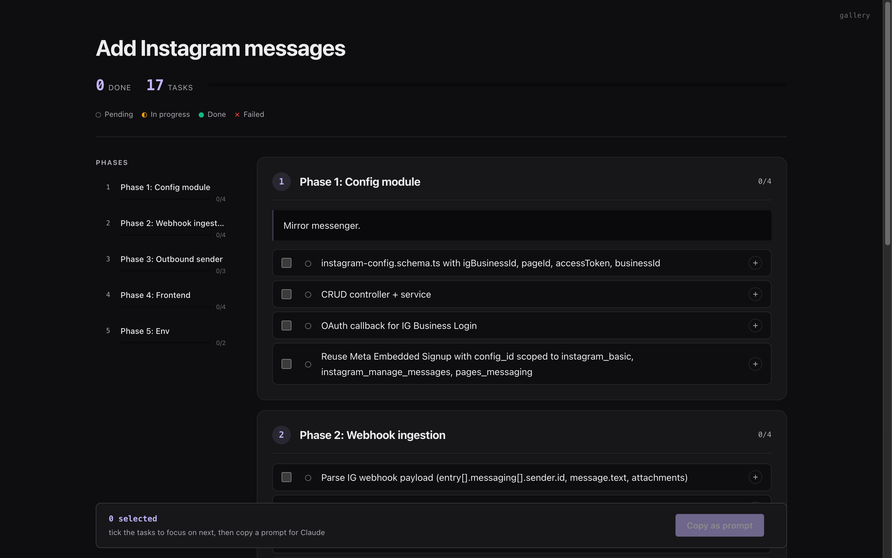

<h1 align="center">plugins</h1>

<p align="center">Claude Code plugins.</p>

<p align="center">
  <a href="https://ibrahemid.github.io/plugins/">Live gallery</a>
</p>

<p align="center">
  <a href="https://ibrahemid.github.io/plugins/to-html/">
    
  </a>
</p>

## Install

```
/plugin marketplace add ibrahemid/plugins
```

## Available

### [`to-html`](./plugins/to-html) — HTML rendering mode

Toggle with `/to-html`. Every substantive reply is classified and rendered into a self-contained HTML file that opens in the browser. Plans get a live dashboard with focus checkboxes. Comparisons get pickers. Explainers get a TL;DR + TOC. Trivial replies skip.

```
/plugin install to-html@ibrahemid
```

[See live, interactive examples →](https://ibrahemid.github.io/plugins/to-html/)

### [`sesh`](./plugins/sesh) — auto-name CC sessions

Silent `UserPromptSubmit` hook that names the session after a few user messages based on conversation context.

```
/plugin install sesh@ibrahemid
```

## License

MIT.
