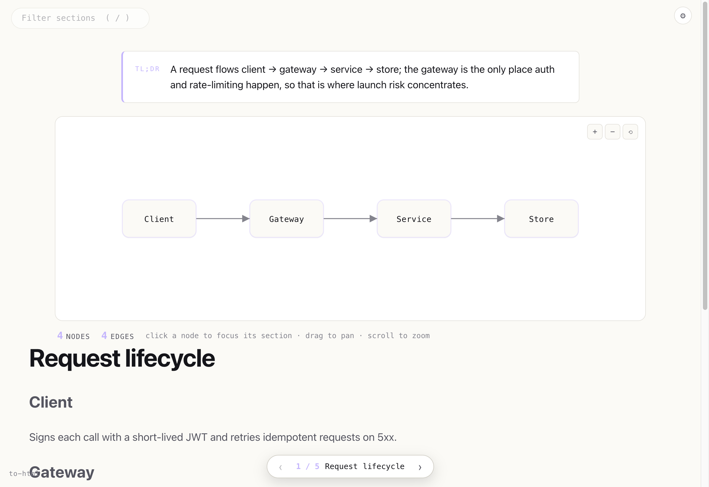

<h1 align="center">plugins</h1>

<p align="center">Claude Code plugins.</p>

<p align="center">
  <a href="https://ibrahemid.github.io/plugins/">Live gallery</a>
</p>

<p align="center">
  <a href="https://ibrahemid.github.io/plugins/to-html/">
    
  </a>
</p>

## Install

```
/plugin marketplace add ibrahemid/plugins
```

## Available

### [`to-html`](./plugins/to-html) — HTML rendering

Toggle with `/to-html`. Substantive replies render to a self-contained HTML page with a TL;DR, an interactive concept map from `mermaid` blocks, and a body set for reading. Plans get a live dashboard; comparisons get pickers. Quiet by default: short or flat replies render nothing.

```
/plugin install to-html@ibrahemid
```

[See live, interactive examples →](https://ibrahemid.github.io/plugins/to-html/)

### [`sesh`](./plugins/sesh) — auto-name CC sessions

Silent `UserPromptSubmit` hook that names the session after a few user messages based on conversation context.

```
/plugin install sesh@ibrahemid
```

## License

MIT.
