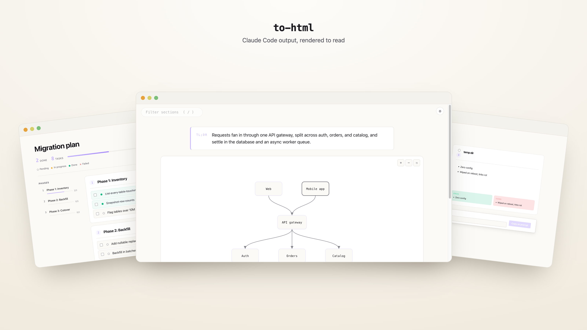

<h1 align="center">plugins</h1>

<p align="center">Claude Code plugins. <a href="https://ibrahemid.github.io/plugins/">Live gallery</a></p>

<p align="center">
  <a href="https://ibrahemid.github.io/plugins/to-html/">
    
  </a>
</p>

## Install

```
/plugin marketplace add ibrahemid/plugins
```

## [`to-html`](./plugins/to-html)

Type `/to-html` and substantive replies render to a self-contained HTML page: a TL;DR, an interactive concept map from `mermaid` blocks, and a body set for reading. Plans get a live dashboard; comparisons get pickers. Quiet by default: short or flat replies render nothing.

```
/plugin install to-html@ibrahemid
```

Config (`/to-html config <key> <value>`): `auto-open` `yes|no`, `theme` `auto|light|dark|sepia`, `size` `s|m|l|xl`, `width` `narrow|comfortable|wide`, `font` `sans|serif`. Diagnostics: `/to-html diag`. Details: [gallery](https://ibrahemid.github.io/plugins/to-html/) · [changelog](./plugins/to-html/CHANGELOG.md).

## [`sesh`](./plugins/sesh)

Silent `UserPromptSubmit` hook that names the session after a few user messages based on conversation context.

```
/plugin install sesh@ibrahemid
```

## Notes

Deterministic Node, no npm install, vendored `marked`. Claude never writes HTML. Strict CSP: no network, no remote assets, no forms. Node 18+.

MIT.
