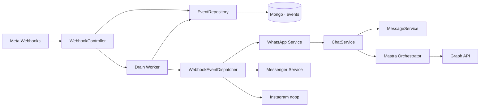

# Webhook ingestion flow

The accept-fast, process-durably path. Meta gets a `200` before any business logic runs; retries are owned by the worker, not Meta. The dispatcher routes by platform — Instagram lands on a no-op until the IG processor exists.

Hover any service to trace its callers and callees. Click to pin the focus.
